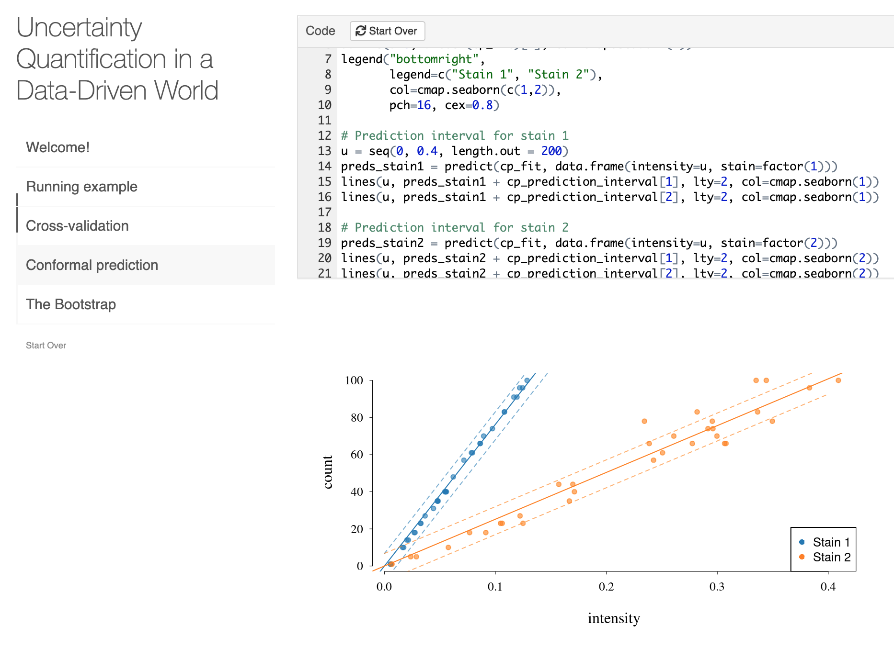

# Uncertainty-Quantification-Workshop
Uncertainty quantification in a data-driven world: an overview of cross-validation, conformal prediction and the bootstrap




## How to get started

### Method 1

1. [Connect to Duke's VPN](https://oit.duke.edu/what-we-do/services/vpn#:~:text=You%20can%20connect%20to%20Duke's,software%20program%20onto%20your%20computer.&text=Or%20you%20can%20visit%20https,VPN%20software%20onto%20your%20computer.)
2. Find the online tutorial here: http://num1.stat.duke.edu:3939/content/7

### Method 2

1. Clone this repository.
2. Install the `learnr`package:
```
install.packages("learnr")
```
3. In RStudio, open the `Uncertainty Quantification Workshop.Rmd` file and click on "Run Document".
