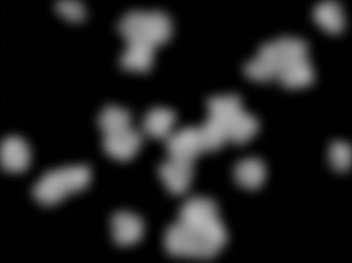
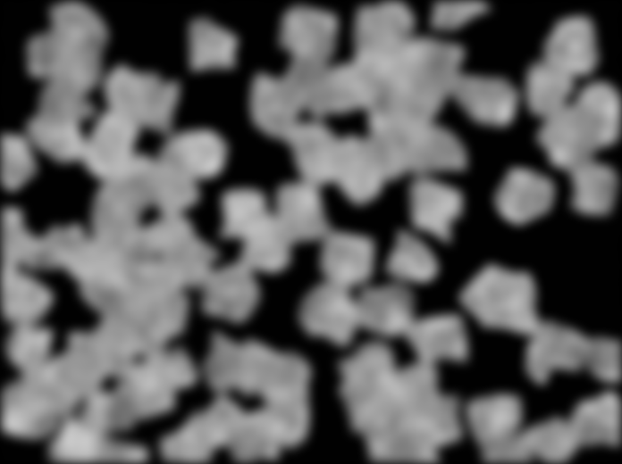
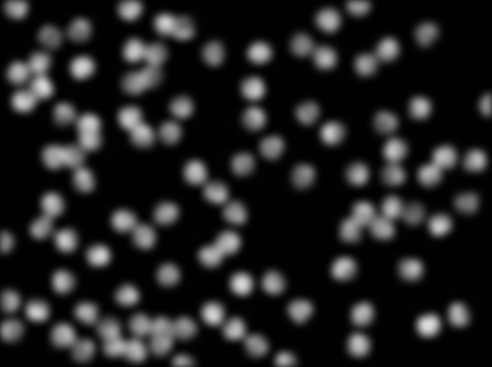

```{r setup, include=FALSE}
knitr::opts_chunk$set(echo = FALSE)

source("R/prettyplot.R")
library(learnr)

train_data = readRDS("data/train_data.rds")
test_data = readRDS("data/test_data.rds")

least_square_fit = lm(count ~ stain:intensity - 1, data=train_data)
predictions = predict(least_square_fit, test_data)
true_counts = readRDS("data/true_counts.rds")[101:200]

RMSE = function(truth, predicted) {
  sqrt(mean((truth-predicted)^2))
}

p = 5

validation_split = sample(1:nrow(train_data), p)
training_split = setdiff(1:nrow(train_data), validation_split)

fit = lm(count ~ stain:intensity, data=train_data[training_split, ])
preds = predict(fit, train_data[validation_split, ])

cp_training_split = sample(1:nrow(train_data), 70)
cp_fit = lm(count ~ stain:intensity - 1, data=train_data[cp_training_split, ])

cp_validation_split = setdiff(1:nrow(train_data), cp_training_split)

truth = train_data[cp_validation_split, "count"]
preds = predict(cp_fit, train_data[cp_validation_split, ])
  
errors = truth - preds
hist(errors)

cp_prediction_interval = quantile(errors, c(0.05, 0.95))

n = nrow(train_data)
bootstrap_sample = train_data[sample(1:n, n, replace=TRUE), ]

boot_replicates = replicate(200, {
  n = nrow(train_data)
  bootstrap_sample = train_data[sample(1:n, n, replace=TRUE), ]
  fit_star = lm(count ~ stain:intensity - 1, data=bootstrap_sample)
  beta_star = coef(fit_star)[1]
})

beta1 = coef(least_square_fit)[1]
t_hat = quantile(abs(beta1 - boot_replicates), 0.95)

c(beta1 - t_hat, beta1 + t_hat)
```


##  Welcome!

###

This tutorial is an introduction to **uncertainty quantification in a data-driven world.**

Following a series of examples, you will learn to quantify uncertainty about the output of stat/ML algorithms using:

- Cross-validation
- Conformal prediction
- Bootstrap methods

This accompanies Olivier's **Uncertainty Quantification Workshop**.

### Prerequisites 

This is only an **introduction** to uncertainty quantification, and as such I do not assume much background.

I only assume that:

1. You work (or will work) with data of some kind.
2. You use or will use some sort of stat/ML algorithm to output prediction/estimates/decisions.
3. You want to understand how confident you should be in the output of these algorithms.

This tutorial is in the `R` programming language. If you worked with other langues such as Python, you should still be able to follow the main ideas with some Googling as necessary.

Note that you can always start over the tutorial by clicking on the corresponding button on the left of the screen, right under the table of contents.

**Other important note:** the code you run in one chunk will never affect the result of other chunks, to make sure that you can't break the tutorial. Run all of your code in a single chunk if you want to experiment.

Ready to get started? Let's go!

## Running example

###

Consider the problem of **counting biological cells in microscopic images**.

We want to build an algorithm which **takes images** as the ones below and which **outputs a count** of the number of cells.

<span style="margin:10%">
  
  
  
</span>

Note that there are **two "stains"** represented here. Certain images represent whole cells (that's **Stain 2**) and other images only capture cell nuclei (that's **Stain 1**).

This problem comes from the Statistical Society of Canada's [2019 Case Study competition](https://ssc.ca/en/case-study/case-study-1-counting-cells-microscopic-images) held in Calgary.

### Machine learning

How are we going to build this algorithm? Using "machine learning" (obviously!)

We're given hundreds of images for which the counts are known. This is our **training data**. We'll use this to build the counting algorithm.

We want to predict the counts for another set of images which is called the **testing data**. Only the organizers of the competition know the true counts for this test data.

### The data

For this tutorial (and so that I don't crash our Duke stat server), I simplified the data a little bit.

- I'm giving you 100 training images
- I'm giving you 100 test images (for which I know the true counts)
- For all of the images, we know the **stain** (if we see the whole cell or just the cell nuclei).
- I added some noise to make the problem more difficult.

Furthermore, so that we don't have to deal with gigabytes of data, I computed for each of these images their luminosity or **mean intensity**. That is, I computed the average of the pixel values. We'll use that to get the counts.

You take a look at the datasets below by clicking the `Run Code` button. Note that, for image in the test set, the "count" value is not available (`NA`).

```{r read_train, exercise=TRUE}
head(train_data)
```

```{r read_test, exercise=TRUE}
head(test_data)
```


### The model

Our big machine learning model to automatically count cells in microscopic images will be... a simple linear regression. That is, for each image's count and intensity, with $j = 1,2$ representing the type of stain, we write 

$$
  \text{count} = \text{intensity}\beta_j + \text{error}.
$$
We estimate the coefficients $\beta_j$ by least squares on the training data in order to get count estimates on the test data.

**Why a linear model?** It fits the data extremely well. If I had not added noise, we would have an average error of only about 1-2 cells for images containing up to a hundred cells. It is possible to improve this a little, but for this tutorial the simple linear model is sufficient.

###

In the chunk below, the function `lm` specifies that we're fitting a linear model. The formula `count ~ stain:intensity` means that we represent the counts as being proportional to the image intensity, with a proportionality constant depending on the stain.

```{r LS_fit, exercise=TRUE}
least_square_fit = lm(count ~ stain:intensity - 1, data=train_data)
least_square_fit
```

You can see the result below: we fitted a line through each of the stain group (make sure to run the code).

```{r LS_plot, exercise=TRUE}
with(train_data,
  plot(intensity, count, col=cmap.seaborn(stain))
)
abline(a=0, b=coef(least_square_fit)[1], col=cmap.seaborn(1))
abline(a=0, b=coef(least_square_fit)[2], col=cmap.seaborn(2))
legend("bottomright", 
       legend=c("Stain 1", "Stain 2"), 
       col=cmap.seaborn(c(1,2)),
       pch=16, cex=0.8)
```

### Predictions

Now that we fitted our model to the data, we can make predictions for the test set.

```{r predictions, exercice=TRUE}
predictions = predict(least_square_fit, test_data)
```

The question now is: **how good are these predictions?**

We will now see how cross-validation, conformal prediction and the bootstrap allows us to address different aspects of this question.

## Cross-validation

### What is cross-validation?

It is a method used to estimate how good your predictions are **on the test set**.

In other words, it is used to estimate the **generalization error** or generalization performance of your model.

#### Measuring performance

Before doing cross-validation, we have to establish what we mean by **performance**. One common approach to quantify performance is to look at the root mean squared error (RMSE)
$$
  \text{RMSE} = \sqrt{\frac{1}{n} \sum_{i=1}^n(Y_i - \hat Y_i)^2}
$$
where $Y_i$ is the true count of the $i$th image in the test set, and $\hat Y_i$ is our prediction.

```{r rmse, exercise=TRUE}
RMSE = function(truth, predicted) {
  sqrt(mean((truth-predicted)^2))
}
```

### The cross-validation algorithm

Since we don't have access to the true counts for the test set, the trick will be to create a **fake test set** using only part of the training data. This is called the **validation set** or **validation**. The rest of the training data, which is not in the **validation split**, is called the **training split**.

Then:

1. we do as if we only had access to the training split to train the model,
2. we make predictions on the validation split, and
3. we compute the RMSE on the validation split.

This gives us an estimate of the RMSE on the test set. We can repeat these steps over multiple random splits of the training data and average the results to obtain something more accurate.

### Implementation

Let's see how this looks like in practice.

First let's split the training data by putting $p=2$ randomly chosen data points in the validation split. 

```{r split, exercise=TRUE}
p = 5
validation_split = sample(1:nrow(train_data), p)
training_split = setdiff(1:nrow(train_data), validation_split)
```

###

Then we can fit the model on the training split and make predictions on the validation split.

```{r cv_fit, exercise=TRUE}
fit = lm(count ~ stain:intensity, data=train_data[training_split, ])
preds = predict(fit, train_data[validation_split, ])
```

###

Finally we compute the RMSE for these predictions.

```{r cv_rmse, exercise=TRUE}
RMSE(train_data[validation_split, "count"], preds)
```

###

The procedure can be repeated over random splits in order to obtain a more stable estimate.

```{r cv, exercise=TRUE, exercise.timelimit=5}
p = 5
cv_RMSEs = replicate(100, {
  validation_split = sample(1:nrow(train_data), p)
  training_split = setdiff(1:nrow(train_data), validation_split)
  
  fit = lm(count ~ stain:intensity, data=train_data[training_split, ])
  preds = predict(fit, train_data[validation_split, ])

  RMSE(train_data[validation_split, "count"], preds)
})

mean(cv_RMSEs)
```

### Does it work?

For this tutorial, I actually know what's the true cell counts for the images in the test set (I cheated!)

So let's see how the cross-validation estimate of RMSE compares to its true value. Recall that we had stored our test set predictions in the variable `predictions`.

```{r}
RMSE(true_counts, predictions)
```

Well, that's not too good, is it? The true error is about twice as high as the estimated error!

```{r whatsgoingon, echo=FALSE}
question("What's going on?",
  answer("Cross-validation doesn't work", correct = FALSE),
  answer("We made a mistake.", correct = TRUE),
  incorrect = "Incorrect. We made a mistake!"
)
```

###

The problem is that there is **more of stain 2** in the test data than there is in the training data. Futhermore, we better predict the count for images with stain 1 than those with stain 2 (recall how the data was more spread out around the regression line with stain 2).

```{r stain_problem, exercise=TRUE}
mean(train_data$stain == 1)
mean(test_data$stain == 1)
```

```{r, echo=FALSE, fig.align="center"}
with(train_data,
  plot(intensity, count, col=cmap.seaborn(stain))
)
abline(a=0, b=coef(least_square_fit)[1], col=cmap.seaborn(1))
abline(a=0, b=coef(least_square_fit)[2], col=cmap.seaborn(2))
legend("bottomright", 
       legend=c("Stain 1", "Stain 2"), 
       col=cmap.seaborn(c(1,2)),
       pch=16, cex=0.8)
```


### Fundamental principles of cross-validation

- It only works if your test data has the same composition as your training data.
- You should **always check** if that's the case.
- If it's not the case, then you need to figure out a way to make your validation split look like your test data.


## Conformal prediction

###

Conformal prediction is a very simple technique used to obtain **prediction intervals**. Just like cross-validation, it relies on the data splitting principle.

It only uses part of your training data in order to train your model and make predictions. The other part of your training data is used to estimate the error distribution of your predictions and get prediction intervals.

It works best when you have **a lot** of data, enough that it doesn't hurt to put some aside to estimate the error distribution.

### The conformal prediction algorithm

We first split the training data into two parts.

The first is the training split, on which we fit out model. Here we put 70 data points in the training split, so that we have a sufficiently good estimate of the error distribution.

```{r cpsplit, exercise=TRUE}
cp_training_split = sample(1:nrow(train_data), 70)
cp_fit = lm(count ~ stain:intensity - 1, data=train_data[cp_training_split, ])
```

Then, we compute the error distribution on the validation split.

```{r cpvalidationsplit, exercise=TRUE}
cp_validation_split = setdiff(1:nrow(train_data), cp_training_split)

truth = train_data[cp_validation_split, "count"]
preds = predict(cp_fit, train_data[cp_validation_split, ])
  
errors = truth - preds
hist(errors)
```

###

The quantiles of the error distribution, centered around your test set predictions, are valid prediction intervals.

```{r cpquantile, exercise=TRUE}
cp_prediction_interval = quantile(errors, c(0.05, 0.95))
cp_prediction_interval
```

### Visualizing uncertainty

Here's a plot representing the conformal prediction uncertainty estimates (make sure to run the code). The dotted lines represent the computed *prediction intervals*.

```{r cp_CI, exercise=TRUE}
# Plot of the model fit
with(train_data[cp_training_split, ],
  plot(intensity, count, col=cmap.seaborn(stain))
)
abline(a=0, b=coef(cp_fit)[1], col=cmap.seaborn(1))
abline(a=0, b=coef(cp_fit)[2], col=cmap.seaborn(2))
legend("bottomright", 
       legend=c("Stain 1", "Stain 2"), 
       col=cmap.seaborn(c(1,2)),
       pch=16, cex=0.8)

# Prediction interval for stain 1
u = seq(0, 0.4, length.out = 200)
preds_stain1 = predict(cp_fit, data.frame(intensity=u, stain=factor(1)))
lines(u, preds_stain1 + cp_prediction_interval[1], lty=2, col=cmap.seaborn(1))
lines(u, preds_stain1 + cp_prediction_interval[2], lty=2, col=cmap.seaborn(1))

# Prediction interval for stain 2
preds_stain2 = predict(cp_fit, data.frame(intensity=u, stain=factor(2)))
lines(u, preds_stain2 + cp_prediction_interval[1], lty=2, col=cmap.seaborn(2))
lines(u, preds_stain2 + cp_prediction_interval[2], lty=2, col=cmap.seaborn(2))
```

### Drawbacks

There are many drawbacks to this simple type of conformal prediction.

For one thing, the prediction intervals are the same length, no matter what the intensity of the image is.

So for an image with zero intensity (where we know there's no cell), we have a prediction interval which includes positive and negative values.

Furthermore, conformal prediction also requires your testing data to have the same composition as your training data in order to be valid.

There are much more sophisticated approaches to building prediction intervals, including using density regression and quantile regression to estimate the conditional error distribution, but this conformal prediction approach is a worthwhile starting point.

## The Bootstrap

###

Bootstrap methods are mainly used for two things:

1. To understand sampling variability: what if you were to repeat sampling data? How variable are your estimates?
2. To understand the relationship of the population to the sample. For instance, how biased are your estimates?

Here, the **population** refers to the underlying distribution that your training data approximates.

Boostrap methods address questions (1) and (2) through the Bootstrap principle, which states that **the relationship of the population to the sample is approximately the same as the relationship of the sample to its subsample**.

### Ingredients

We need a few ingredients to understand bootstrap methods and the underlying principle.

Consider again our model

$$
  \text{count} = \text{intensity}\beta_j + \text{error}.
$$

We can imagine a "true" coefficient $\beta_j$, which corresponds to what we'd estimate if we had an infinite amount of training data. 

Our estimate $\hat \beta_j$ is computed from a sample from the population (we only used 100 training images). If we had picked other images to train the model, we would have obtained a different estimate of $\hat \beta_j$.

###

A **bootstrap sample** is obtained from resampling our training data. That is, we construct a new training data set of the same size as the original training data, and where each data point of this new set is obtained by picking a data point at random from the original training data.

More precisely, if our image training data is denoted by $\mathcal{D} = (Z_1, \dots, Z_n)$, then a bootstrap sample is $\mathcal{D}^* = (Z_1^*, \dots, Z_n^*)$ with
$$
  \mathbb{P}(Z_i^{*} = Z_j) = 1/n\, \quad \text{for }j =1,2,\dots, n. 
$$

In practice, a bootstrap sample is obtained by sampling with replacement from the rows of our training data.

```{r bootsample, exercise=TRUE}
n = nrow(train_data)
bootstrap_sample = train_data[sample(1:n, n, replace=TRUE), ]
```


###

A **bootstrap replicate** of our estimate $\hat \beta_j$ is denoted by $\hat \beta_j^*$ and obtained by fitting out model to a bootstrap sample $\mathcal{D}^*$.

So, given our bootstrap sample, we fit our model and then extract the coefficients $\beta_j$.

```{r b1, exercise=TRUE}
fit_star = lm(count ~ stain:intensity - 1, data=bootstrap_sample)
beta_star = coef(fit_star)
```


### Estimating sampling variation

The sampling variability of the estimate $\hat \beta_j$ is defined as 
$$
  \mathbb{E}_{\hat \beta_j }\left[\left(\hat \beta_j - \mathbb{E}[\hat \beta_j]\right)^2\right],
$$
it is the average, over all estimates of $\hat \beta_j$ we could obtain by resampling from the population, of the squared distance to its mean.

We can't compute the above explicitely, since we don't have access to the underlying data distribution.

However, we can **approximate** the above by the **sampling variability of a bootstrap replicate**. That is, we approximate the above by
$$
  \mathbb{E}_{\hat \beta_j^*} \left[\left(\hat \beta_j^* - \mathbb{E}[\hat \beta_j^*]\right)^2\right],
$$
where the expectation (average) is taken over all bootstrap replicates of $\hat \beta_j$. This can be computed explicitely, since we can generate as many bootstrap replicates as we want.

###

Below, we generate 200 bootstrap replicates of $\hat \beta_1$.

```{r b2, exercise=TRUE}
boot_replicates = replicate(200, {
  n = nrow(train_data)
  bootstrap_sample = train_data[sample(1:n, n, replace=TRUE), ]
  fit_star = lm(count ~ stain:intensity - 1, data=bootstrap_sample)
  beta_star = coef(fit_star)[1]
})
```

The variance of the replicates is an estimate of the sampling variability of $\hat \beta_j$.

```{r b3, exercise=TRUE}
mean((boot_replicates - mean(boot_replicates))^2)
```


### Estimating bias

We can also use the bootstrap to estimate bias. 

That is, the bias of the estimate $\hat \beta_j$ is defined as
$$
  \mathbb{E}_{\hat\beta_j} \left[ \beta_j - \hat \beta_j \right]
$$
where the expectation (average) is taken over all possible ways we could have obtained $\hat \beta_j$ by sampling from the underlying population.

###

Using the bootstrap principle, we approximate the bias by
$$
  \mathbb{E}_{\hat\beta_j^*} \left[ \hat \beta_j - \hat \beta_j^* \right],
$$
where the expectation is taken over all **bootstrap replicates**.

```{r b4, exercise=TRUE}
beta1 = coef(least_square_fit)[1]
mean(beta1 - boot_replicates)
```

### Confidence intervals

Finally, let's try to compute a **confidence interval** for $\beta_1$. 

A (symmetric) confidence interval is an interval estimate of $\beta_1$ of the form
$$
  \hat \beta_1 \pm t,
$$
where $\mathcal{D}$ is the training data. 

It has $95\%$ coverage if it is $95\%$ accurate: we want that $95\%$ of the time, if we were to resample the data $\mathcal{D}$ from its underlying distribution, then we'd have 
$$
  |\beta_1 - \hat \beta_1| <  t.
$$

###

Using the bootstrap principle, we instead find $\hat t$ such that, $95\%$ of the time over *bootstrap replicates* we have
$$
|\hat \beta_1 - \hat \beta_1^*| < \hat t.
$$

This is done using a quantile of the distribution of $|\hat \beta_1 - \hat \beta_1^*|$.

```{r b5, exercise=TRUE}
beta1 = coef(least_square_fit)[1]
t_hat = quantile(abs(beta1 - boot_replicates), 0.95)
```

The confidence interval is therefore:
```{r b6, exercise=TRUE}
c(beta1 - t_hat, beta1 + t_hat)
```

### Doing more

- For confidence intervals, you can do better than what I presented here. You can use ``bias-corrected and accelerated'' bootstrap confidence intervals instead.

- Note that bootstrap confidence intervals can be very poor in practice. You should **always** check if the bootstrap method works in artificial examples where you know the true data-generating distribution.

- You can also use the bootstrap to compute **prediction intervals**.

- You can use **bootstrap aggregation** to reduce variance of your predictions (that's done with random forests).

- **Fun fact:** In bootstrap samples, around $37\%$ of the original data points are ignored. You can use these ignored data points to do bootstrapping and cross-validation at the same time (that's done with random forests).


